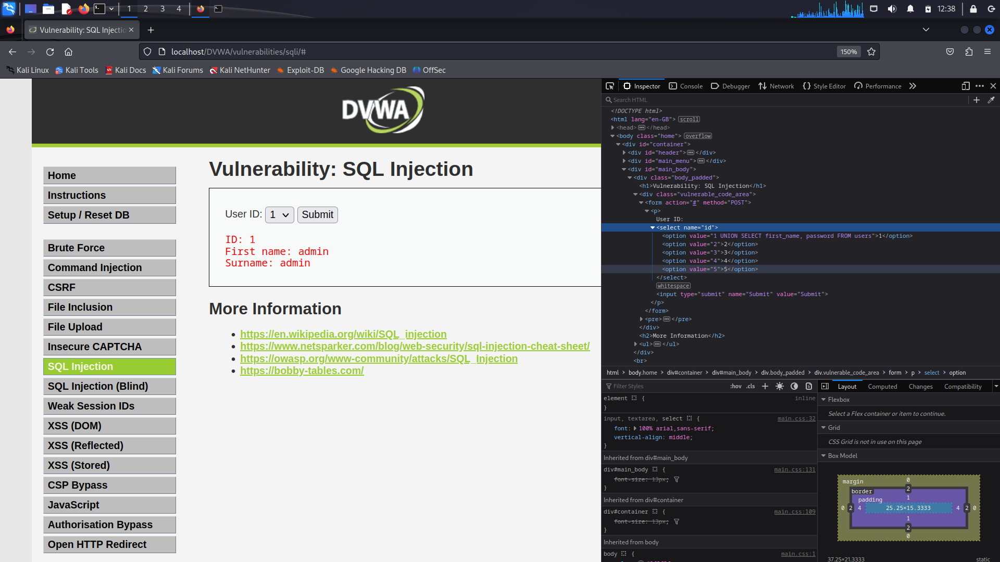

# dvwa-med
DVWA medium: SQL Injection & SQL Injection (blind)

## SQL INJECTION

### Serangan di DVWA dengan security level medium

> Task: sama seperti pada serangan low

Cara:
1. Ubah difficulty serangan menjadi medium pada tab `DVWA Security`


2. Buka tab `SQL Injection` dan lihat source nya
>
>Dapat dilihat bahwa pada bagian pengeksekusian query hampir sama dengan diff low hanya saja pada `$id` tidak ada tanda petik serta pengiriman data menggunakan _POST sehingga query yang akan di inject akan sedikit berbeda

3. Query yang akan di inject berupa:

```
1 UNION SELECT first_name, password FROM users
```
>karena menggunakan UNION, maka jumlah kolom yang ditampilkan harus sama dengan query sebelumnya
>
>query asli: first_name, last_name
>
>query injeksi: first_name, password

4. Injek query yang sudah disiapkan melalui `inspect`
>Kenapa menggunakan `inspect`? karena field id berupa optian bukan textbox sehingga tidak dapat mengetik secara langsung

>
>tahapan inspect:
>
>klik kanan, pilih inspect, klik icon kotak-kursor pada bagian pojok kiri atas jendela inspect, lalu klik field option id

>
>letakkan query kedalam value pada salah satu tag option

5. Tekan tombol Submit dan hasilnya akan keluar

>
>hasil injeksi dapat dilihat pada baris data setelah baris pertama (admin/admin)
>
>first_name = first_name
>surname = password

6. Hash yang sudah didapatkan dapat didecrypt seperti pada diff low untuk mendapatkan password sebenarnya

## SQL INJECTION (BLIND)

### Serangan di DVWA dengan security level medium
1. Ubah difficulty serangan menjadi medium pada tab `DVWA Security`


2. Buka tab `SQL Injection (Blind)` kemudian inspect, pilih tab network, lalu klik submit


3. Pilih data teratas dan catat cookies dan raw requestnya
>Pilih tab `Cookies` pada bagian bawah untuk melihat cookies yang ada
>

>Pilih tab `Request` pada bagian bawah lalu tekan togle `Raw` untuk melihat raw request yang dikirimkan
>

>catat dengan format yang sesuai pada gambar dibawah
>

4. Buka terminal dan jalankan command sqlmap berikut:
```
sqlmap -u "[url]" --cookie="[cookies]" --data="[request]" --dbms --batch
```
>Sesuaikan command dengan data yang didapatkan sebelumnya
>
>`[url]` = url dari laman DVWA yang saat ini dibuka 
>
>`[cookies]` = cookies yang telah di catat sesuai format
>
>`[request]` = raw request yang telah dicatat sesuai format 


Didapatkan daftar database yang ada pada server
```
[*] dvwa
[*] information_schema
```

5. Ubah command sqlmap sebelumnya menjadi:
```
sqlmap -u "[url]" --cookie="[cookies]" --data="[request]" -D dvwa --tables --batch
```
>command di atas akan menampilkan tabel yang ada dalam database dvwa


6. Ubah lagi command sqlmap sebelumnya untuk menampilkan data dalam tabel users
```
sqlmap -u "[url]" --cookie="[cookies]" --data="[request]" -D dvwa -T users --dump --batch
```
>--dump digunakan untuk menampilkan semua data didalam sebuah tabel


>karena enkripsi password yang sederhana menggunakan `md5`, sqlmap secara otomatis mendekripsi semua password yang ada